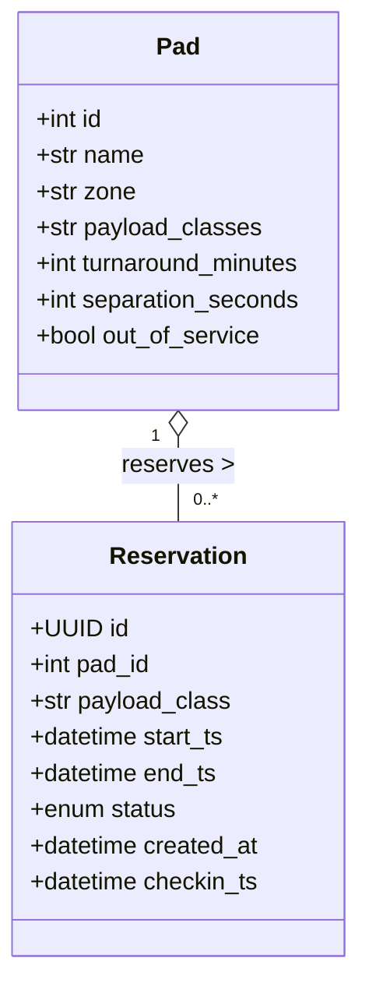
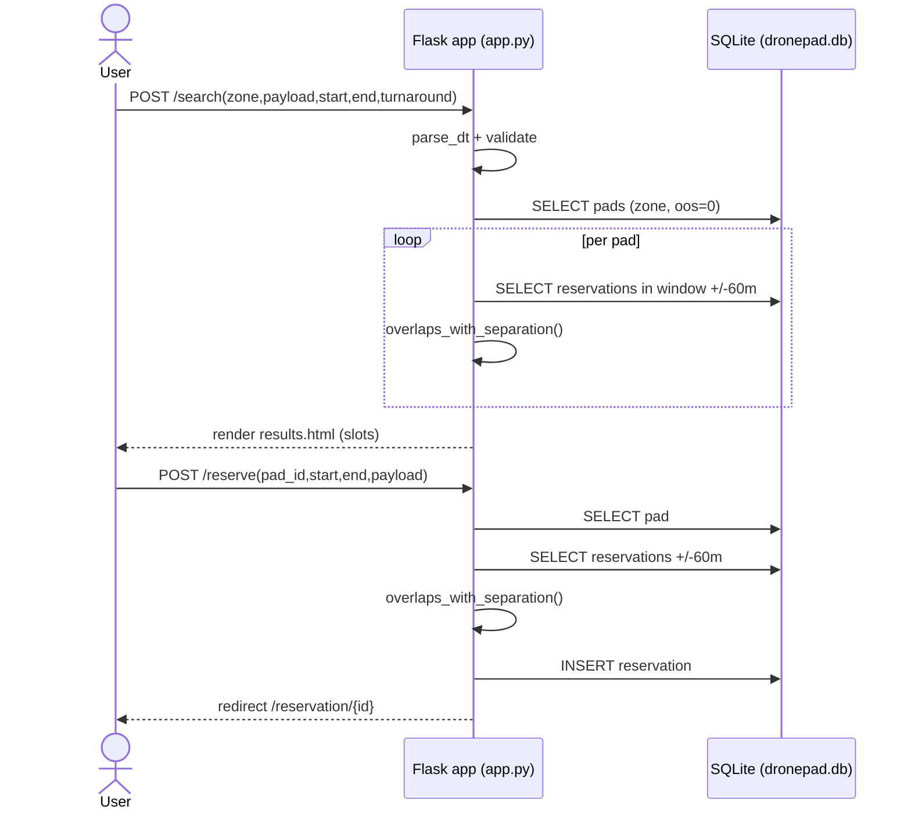
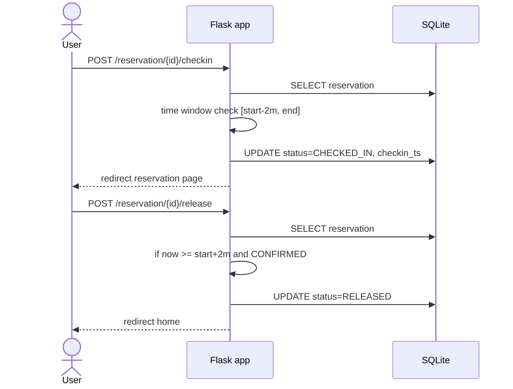
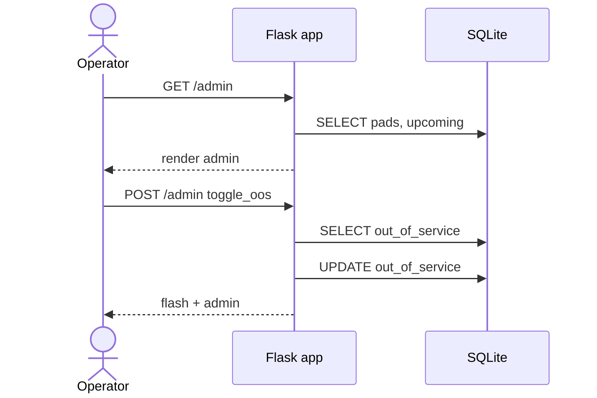
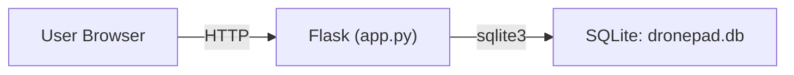

# DronePad UML – Mermaid versions (for markdown or docs)

## Class Diagram (Data Model)

## Sequence – Search & Reserve

## Sequence – Check-in & Release

## Sequence – Admin toggle OOS

## Deployment
